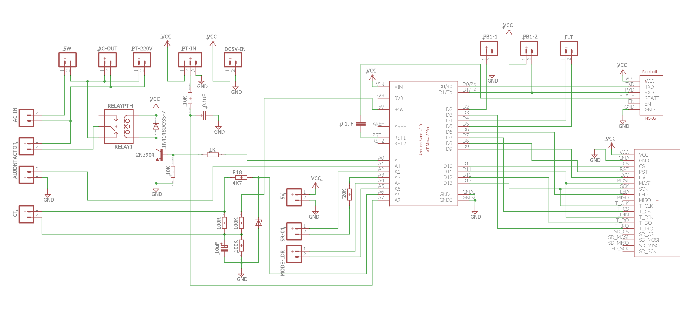
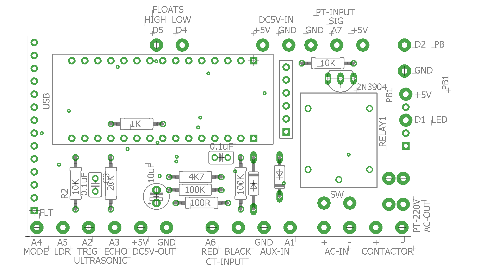
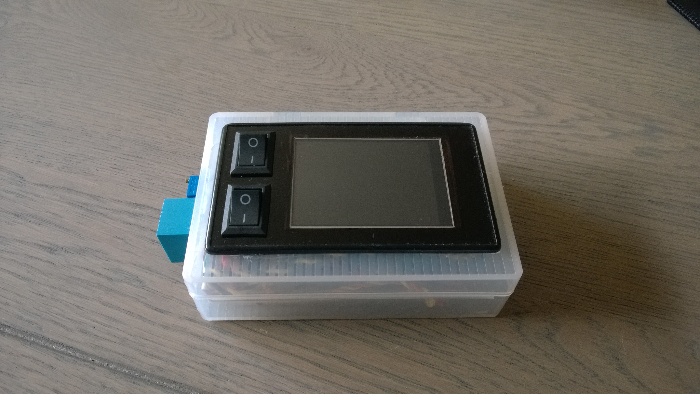
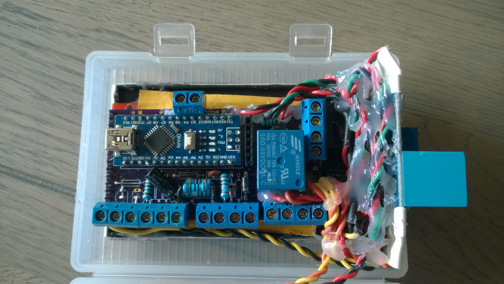
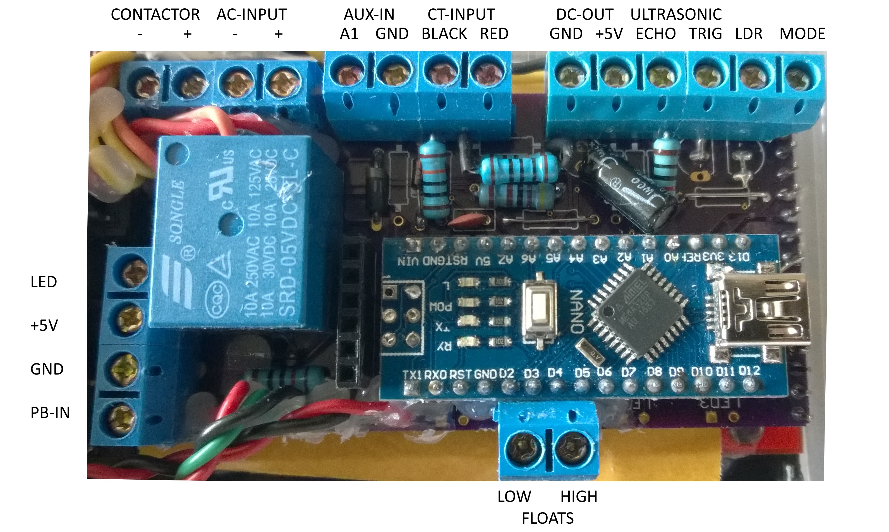

# Water Pump controller

This repository contains two projects:

- [KiCAD schematics](https://gitea.odroid.hc/hobby-projects/water-pump-controller/src/branch/master/kicad)
- [Visual Studio Code Arduino application](https://gitea.odroid.hc/hobby-projects/water-pump-controller/src/branch/master/visual-studio-code)

## Schematics

## Board

## Prototype

